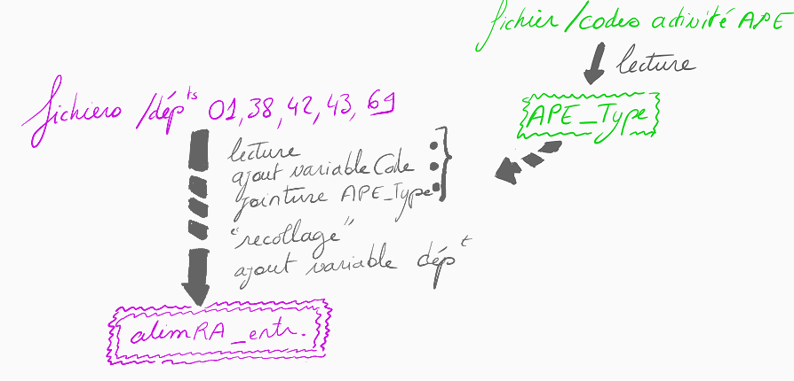
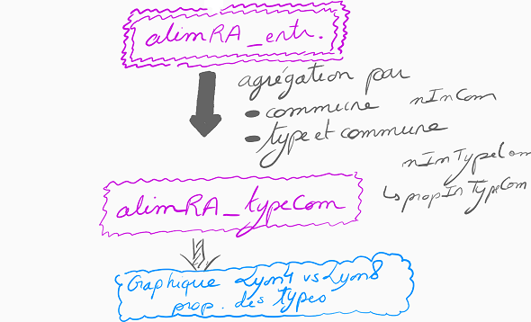
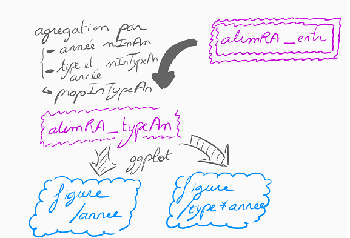
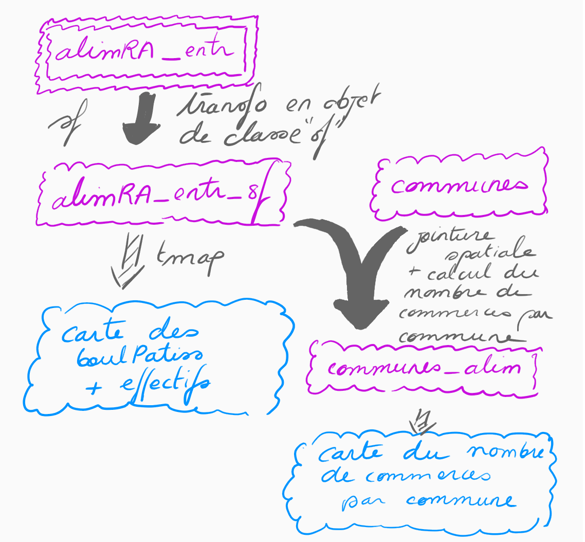

```{r setup, include=FALSE}
#knitr::opts_chunk$set(echo = TRUE)

knitr::opts_chunk$set(tidy.opts = list(width.cutoff = 60),  # For code
                      width = 60, tidy = TRUE)  # For output
```

## R Markdown

Ce fichier montre les résultats des questions du TP disponible [ici](http://perso.ens-lyon.fr/lise.vaudor/Supports_formation/cours_geonum/organisation_cours_R.html). J'ai choisi de ne pas afficher tout le temps le code R que j'ai écrit pour répondre aux questions. Les résultats sont tous affichés dans le document. Le code R Markdown est disponible sur [mon compte GitHub](https://github.com/benoitblanc/R-Sirene). J'ai utilisé les données de Janvier 2020 pour les entreprises.

Ce TP consiste à travailler sur des données de la base Sirene de l’INSEE, mise à disposition sur [data.gouv.fr](https://www.data.gouv.fr/fr/), et qui répertorie l’ensemble des entreprises et établissements actifs en France. Les métadonnées associées à cette base sont en partie décrites dans [ce tableau](https://www.data.gouv.fr/s/resources/base-sirene-des-entreprises-et-de-leurs-etablissements-siren-siret/20170112-180748/liste-modalites-l2.csv).

***
\newpage
# Mise en place

```{r echo=FALSE, out.width="400pt"}
knitr::include_graphics("workflow.png")
```

Pour réaliser ce TP, nous avons besoin de toutes les bibliothèques suivantes :
```{r echo=TRUE, message=FALSE, warning=FALSE}
library(dplyr)
library(readr)
library(stringr)
library(purrr)
library(lubridate)
library(scales)
library(tidyr)
library(ggplot2)
library(sf)
library(tmap)
library(tmaptools)
library(plotly)
library(prettydoc)
library(rmdformats)
```

## Installations, téléchargements, premiers tests sur le département 42
- Téléchargez les données du département 42, geo_siret_42.csv dans [ce répertoire](http://data.cquest.org/geo_sirene/v2019/2020-01/dep/) pour le mois de Janvier 2020 et dézippez le dossier sur votre machine.

- Téléchargez la table qui renseigne les codes correspondant à l’Activité Principale de l’Etablissement (APE)[APE_Type.csv](http://perso.ens-lyon.fr/lise.vaudor/Supports_formation/cours_geonum/data/APE_Type.csv)

## Lecture de tableaux de données
- Depuis RStudio, créez un projet qui comprendra l’ensemble des données et documents nécessaires à réaliser l’ensemble des traitements qui vous seront demandés pour ce TP.

- Créez le data.frame data42 en lisant la table geo-siret_42.csv.

```{r echo=TRUE, message=FALSE, warning=FALSE}
data42 <- read_csv("data/geo_siret_42.csv")
```

- Créez l’objet APE_Type en lisant le fichier relatif aux codes d’APE.

```{r echo=TRUE, message=FALSE, warning=FALSE}
APE_Type <- read_csv("data/APE_Type.csv")
```

## Code et types d’activités => commerces alimentaires
- Combien d’entreprises ont un nom (enseigne1Etablissement) qui comprend le terme “BOULANGERIE”?

```{r include=FALSE}
boulangeries <- filter(data42, str_detect(enseigne1Etablissement, "BOULANGERIE"))
```
Il y a `r summarise(boulangeries, n())` entreprises qui comprennent le terme "BOULANGERIE" dans leur nom.

- Ajoutez une variable Code à votre table en ne conservant que les quatre premiers caractères de la variable activitePrincipaleEtablissement (cela correspond à un pattern “^….”, à savoir le début de chaîne de caractère suivi de quatre caractères quelconques -cf ce billet de blog sur les expressions régulières-).

```{r echo=TRUE}
data42 <- mutate(data42, Code=as.numeric(str_extract(activitePrincipaleEtablissement, "^....")))
```

- Filtrez les lignes de data42 pour ne retenir que celles pour lesquelles l’APE correspond aux commerces “alimentaires” -alimentation, boisson, restaurant, bar- (voir la liste contenue dans le fichier APE_Type).

- Stockez le résultat de ces opérations dans un objet alim42.

```{r eval=FALSE, include=FALSE}
print(APE_Type)
```

```{r include=FALSE}
code_alim <- c("10.1", "10.2", "10.3", "10.5", "10.7", "10.8", "11.0", "47.1", "47.2", "56.1", "56.2", "56.3")
alim42 <- filter(data42, Code %in% code_alim)
```

- Réalisez une jointure entre data42_alim (variable codeAPE) et APE_Type (variable Code), de manière à compléter alim42 avec les types de commerces (variables Type et TypeAbreg).

```{r echo=TRUE}
alim42 <- left_join(alim42, APE_Type, by="Code")
```

## Résumé, classement

- Quelles sont les 3 communes de votre base de données qui comptent le plus de magasins alimentaires?

```{r include=FALSE}
alim42 %>% 
  group_by(codeCommuneEtablissement, libelleCommuneEtablissement) %>%
  summarise(nb_commerces_alim=n()) %>%
  arrange(desc(nb_commerces_alim))
```

```{r echo=FALSE}
morecommerces <- alim42 %>%
  group_by(codeCommuneEtablissement, libelleCommuneEtablissement) %>%
  summarise(nb_commerces_alim=n()) %>%
  arrange(desc(nb_commerces_alim)) %>%
  head(3)
```
Les trois communes comptant le plus de commerces alimentaires sont : `r morecommerces$libelleCommuneEtablissement`

- Pour les communes qui ne comptent qu’un seul commerce “alimentaire”, de quel type est-il, le plus fréquemment?
```{r echo=FALSE}
onlyonecommerce <- group_by(alim42, codeCommuneEtablissement, libelleCommuneEtablissement) %>%
  summarise(nb_commerces_alim=n()) %>%
  filter(nb_commerces_alim==1)
```

Les communes ne comptant qu'un seul commerce "alimentaire" sont au nombre de `r length(onlyonecommerce$codeCommuneEtablissement)`. Avec en détail :
`r onlyonecommerce$libelleCommuneEtablissement`

```{r echo=FALSE}
typeonecommerce <- filter(alim42, codeCommuneEtablissement 
                          %in% onlyonecommerce$codeCommuneEtablissement) %>%
  group_by(Type) %>%
  summarise(nb_types=n()) %>%
  arrange(desc(nb_types)) %>%
  filter(nb_types == max(nb_types))
```
Lorsqu'il y a un seul commerce alimentaire dans une commune, celui-ci est de type `r typeonecommerce$Type`.

- Quelles communes de plus de 100 commerces comptent au moins 10 commerces de type “viande”?
```{r include=FALSE}
data42 <- inner_join(data42, APE_Type, by="Code")
```

```{r echo=TRUE}
morethan100commerces <- group_by(data42, codeCommuneEtablissement, libelleCommuneEtablissement) %>%
  summarise(nb_commerces=n())
morethan100commerces <- filter(morethan100commerces, nb_commerces>=100)
```

Les communes de plus de 100 commerces sont `r morethan100commerces$libelleCommuneEtablissement`

```{r echo=TRUE}
morethan10viandes <- filter(data42, TypeAbreg=='viande') %>%
  group_by(codeCommuneEtablissement, libelleCommuneEtablissement) %>%
  summarise(nb_commerces_viande=n())
morethan10viandes <- filter(morethan10viandes, nb_commerces_viande>=10)
```

Les communes qui ont plus de 10 commerces de type 'viande' sont `r morethan10viandes$libelleCommuneEtablissement`

On retrouve les `r length(morethan10viandes$codeCommuneEtablissement)` communes ayant plus de 10 commerces de type 'viande' dans les villes ayant plus de 100 commerces. On a donc la réponse. Mais pour s'assurer, on peut réaliser une jointure entre les 2 tableaux :

```{r echo=TRUE}
more100commerces10viandes <- left_join(morethan10viandes, morethan100commerces, 
                                       by=c("codeCommuneEtablissement", "libelleCommuneEtablissement"))
```

On retrouve le même résultat : `r more100commerces10viandes$libelleCommuneEtablissement`

***
\newpage
# Rapport, statistiques descriptives
A ce stade, votre script commence à être un peu long et (peut-être) un peu désordonné… Ne serait-ce pas plus agréable de continuer votre projet sous la forme d’un rapport Rmarkdown? (Ne répondez pas à cette question, elle est rhétorique…).

Créez un document ____.Rmd, structurez-le avec quelques titres, et répartissez les différents morceaux de code de votre script de manière pertinente dans différents chunks.
Vous pouvez maintenant rédiger des paragraphes en y intégrant des éléments de réponses aux questions posées précédemment. Rédigez un petit paragraphe pour nommer les 3 communes qui comptent le plus d’entreprises (exercice précédent) en utilisant l’insertion d’“inline chunks”.

Les 3 communes qui comptent le plus d'entreprises sont `r morecommerces$libelleCommuneEtablissement`.

A partir de maintenant, votre document de travail sera un document`___.Rmd’ et non le script que vous avez créé initialement…

***
\newpage
# Programmation: automatisation pour plusieurs départements

```{r echo=FALSE, out.width="400pt"}

```

## Fonction
Pour obtenir la table alim42, vous avez réalisé un certain nombre d’opérations. On voudrait réaliser l’ensemble de ces opérations pour les 5 départements suivants:

- l’Ain (01)
- l’Isère (38)
- la Loire (42)
- la Haute-Loire (43)
- le Rhône (69)

Réutilisez les commandes que vous avez mises au point sur data42 pour écrire une fonction get_clean_data() qui réalisera l’ensemble de ces opérations sur le département de votre choix. L’input correspondra à un numéro de département (c’est-à-dire que vous pourrez utiliser la fonction en faisant, par exemple get_clean_data("01")).

Pour lire le fichier, il faudra indiquer son chemin… Pensez à réutiliser ce que vous venez d’apprendre sur les chaînes de caractères pour reformer le chemin du fichier que vous intéresse à partir du numéro de département…

Certaines chaînes de caractère sont interprétées comme des chaînes de caractère pour certains jeux de données (par exemple pour les codes postaux de l’Ain, à cause du “0” en début de chaîne) tandis qu’elle est interprétée comme un numérique pour les autres jeux de données. Faites en sorte que votre fonction transforme bien cette variable pour qu’elles soient toujours de classe “character” en sortie (conversion par as.character()…).

```{r include=FALSE}
departements <- list("01", "38", "42", "43", "69")
```

```{r echo=TRUE}
get_clean_data <- function(dept) {
  dept <- as.character(dept)
  print(dept)
  # Read CSV file for dept
  filename <- "data/geo_siret_XX.csv"
  filename <- str_replace(filename, "X{2}", dept)
  print(filename)
  data <- read_csv(filename)
  data <- mutate(data, Code=as.numeric(str_extract(activitePrincipaleEtablissement, "^....")))
  alim <- filter(data, Code %in% code_alim)
  alim <- left_join(alim, APE_Type, by="Code")
  
  return(alim)
}
```

```{r include=FALSE}
convert_to_str <- function(param) {
  str_param = as.character(param)
  return(str_param)
}
```

## Itération

- Appelez cette fonction de manière itérative pour chacun des départements cités ci-dessus. Vous pouvez pour ce faire soit écrire une boucle for, soit utiliser la fonction map() du package purrr.

```{r include=FALSE}
if (!file.exists("data/alimRA_entr.csv")) {
  commercesRA <- departements %>% map(get_clean_data)
  #commercesRA <- mutate(commercesRA, codePostalEtablissement=convert_to_str(codePostalEtablissement))
} else {
  alimRA_entr <- read_csv("data/alimRA_entr.csv")
}
```

A partir des 5 jeux de données obtenus vous créerez un seul et même jeu de données alimRA_entr (données pour l’ancienne région Rhône-Alpes, où 1 ligne=1 entreprise).

- Vous pourrez si vous le souhaitez vous servir de la commande do.call("rbind",...) ou bind_rows().

```{r include=FALSE}
if (!file.exists("data/alimRA_entr.csv")) {
  #alimRA_entr <- bind_rows(commercesRA)
  alimRA_entr <- do.call("rbind", commercesRA)
}
```

- Rajoutez une variable departement (correspondant au numéro de département) à votre jeu de données alimRA_entr. Peut-être par des manipulations sur le code postal?…

```{r include=FALSE}
if (!file.exists("data/alimRA_entr.csv")) {
  alimRA_entr <- mutate(alimRA_entr, codePostalEtablissement= as.character(codePostalEtablissement))
  #alimRA_entr <- mutate(alimRA_entr, codePostalEtablissement=gsub("^([0-9]{1,4})", "0\\1", as.character(codePostalEtablissement)))
  alimRA_entr <- mutate(alimRA_entr, departement=str_extract(codePostalEtablissement, "^.{2}"))
}
```

## If et écriture de fichier

Vous avez dû remarquer que l’exécution de l’étape précédente prenait un peu de temps car les 5 fichiers geo-sirene lus sont très volumineux… En revanche la table alimRA_entr est de taille beaucoup plus raisonnable. Or, nous n’aurons besoin que de cette table pour la suite du projet. Pour éviter d’exécuter cette étape chronophage à chaque fois que vous travaillerez sur ce projet:

- exportez alimRA_entr dans un fichier alimRA_entr.csv.
- entourez la boucle for d’une structure conditionnelle if de sorte que la boucle ne soit exécutée que si le fichier alimRA_entr.csv n’existe pas (voir fonction file.exists()…)
- écrivez à la suite la commande qui servira à lire alimRA_entr.csv à chaque “tricotage” de votre rapport Rmarkdown.

```{r include=FALSE}
write_csv(alimRA_entr, "data/alimRA_entr.csv")
alimRA_entr <- read_csv("data/alimRA_entr.csv")
#alimRA_entr <- map(., mutate(., codePostalEtablissement=convert_code_postal(codePostalEtablissement)))
```

***
\newpage
# Résumé par commune et type de commerce

```{r, include=TRUE, echo=FALSE, out.width="400pt"}

```

## Agrégation des données par commune et type de commerce
Agrégez la table alimRA_entr par commune et type de commerce, pour créer une table alimRA_typeCom (où une ligne correspondra à un type de commerce pour une commune):

```{r eval=FALSE, include=FALSE}
get_nb_commerces_by_commune <- function(df) {
  df <- group_by(df, codeCommuneEtablissement, libelleCommuneEtablissement) %>%
    summarise(nb_commerces=n())
  return(df$nb_commerces)
}
#get_nb_commerces_by_type_by_commune <- function(df) {
  
  
#  return(alim)
#}
#get_proportion_type_in_commune {
#<- function(df)   
#}return(0)
```

```{r include=FALSE}
alimRA_Com <- group_by(alimRA_entr, codeCommuneEtablissement, libelleCommuneEtablissement)%>%
  summarise(nInCom=n())
alimRA_type <- group_by(alimRA_entr, codeCommuneEtablissement, libelleCommuneEtablissement, TypeAbreg)%>%
  summarise(nInTypeCom=n()) %>%
  mutate(propInTypeCom = round(nInTypeCom / sum(nInTypeCom)*100, digits = 2))
```

- une variable nInCom correspondant au nombre de commerces par commune
- une variable nInTypeCom correspondant au nombre de commerces par type et commune
- une variable propInTypeCom correspondant à la proportion d’un type de commerce dans une commune

```{r include=FALSE}
alimRA_typeCom <- left_join(alimRA_Com, alimRA_type, 
                                       by=c("codeCommuneEtablissement", "libelleCommuneEtablissement"))
```

Quelles communes comptant plus de 100 commerces comptes au moins 5% de commerces de type “viande”?

```{r include=FALSE}
communes_15pct_bar <- filter(alimRA_typeCom, TypeAbreg=='bar' & nInCom >= 100 & propInTypeCom >= 15)
communes_5pct_viande <- filter(alimRA_typeCom, TypeAbreg=='viande' & nInCom >= 100 & propInTypeCom >= 5)
```

Les communes comptant plus de 100 commerces, dont les commerces de type 'bar' représentent au moins 15% des commerces sont `r communes_15pct_bar$libelleCommuneEtablissement`.

Les communes comptant plus de 100 commerces, dont les commerces de type 'viande' représentent au moins 5% des commerces sont `r communes_5pct_viande$libelleCommuneEtablissement`.

## Graphique
- Réalisez un graphique montrant les proportions des différents types de commerces pour LYON 4EME et LYON 8EME.

```{r echo=FALSE}
lyon4 <- filter(alimRA_typeCom, codeCommuneEtablissement == 69384)
propLyon4 <- ggplot(lyon4, aes(x="", y=propInTypeCom, fill=TypeAbreg))+
  geom_bar(width = 2, stat = "identity", position = "dodge") + geom_text(aes(label=paste("\n", propInTypeCom, "%")), position = position_dodge(width = 2)) +
  ggtitle("Répartition des types de commerces à Lyon 4ème") + scale_fill_discrete(name= "Type de commerce", labels=c("Autre", "Bar", "Boulangerie-Pâtisserie", "Fruits et légumes", "Magasin spécialisé", "Restaurant", "Supermarché", "Traiteur", "Boucherie")) + theme_minimal() + labs(x="", y="Répartition (%)")
propLyon4
```

```{r echo=FALSE}
lyon8 <- filter(alimRA_typeCom, codeCommuneEtablissement == 69388)
propLyon8 <- ggplot(lyon8, aes(x="", y=propInTypeCom, fill=TypeAbreg)) +
  geom_bar(width = 5, stat = "identity", position = "dodge") + geom_text(aes(label=paste("\n",propInTypeCom, "%")),
                                                     position = position_dodge(width = 5)) + 
  ggtitle("Répartition des types de commerces à Lyon 8ème") + scale_fill_discrete(name= "Type de commerce", labels=c("Autre", "Bar", "Boulangerie-Pâtisserie", "Fruits et légumes", "Magasin spécialisé", "Restaurant", "Supermarché", "Traiteur", "Boucherie")) + theme_minimal() + labs(x="", y="Répartition (%)")
propLyon8
```

***
\newpage
# Evolution dans le temps des créations d’entreprise

```{r, include=TRUE, echo=FALSE, out.width="400pt"}

```

## Manipuler des dates avec lubridate
Nous allons nous intéresser aux dates de création des entreprises de notre base alimRA_entr (variable dateCreationEtablissement).

Pour le moment, dateCreationEtablissement est considéré comme une variable de type “chaîne de caractères”. Pour faire comprendre à R qu’il s’agit en réalité d’une date (et lui faire comprendre comment elle est mise en forme) nous allons faire appel au package lubridate.

- Installez et chargez le package lubridate.

- Transformez le tableau alimRA_entr en modifiant la classe de dateCreationEtablissement à l’aide d’une fonction de lubridate.

```{r include=FALSE}
alimRA_entr <- mutate(alimRA_entr, dateCreationEtablissement = ymd(dateCreationEtablissement))
class(alimRA_entr$dateCreationEtablissement)
```

- Ajoutez une variable annee au tableau alimRA_entr à l’aide, à nouveau, d’une des fonctions de lubridate.

```{r include=FALSE}
alimRA_entr <- mutate(alimRA_entr, annee = year(dateCreationEtablissement))
```

## Résumé, filtre
- Créez une table alimRA_typeAn qui recense le nombre d’entreprises par année (nInAn), et par type*année (nInTypeAn).

```{r include=FALSE}
alimRA_annee <- group_by(alimRA_entr, annee)%>%
  summarise(nInAn=n())
alimRA_type_annee <- group_by(alimRA_entr, annee, TypeAbreg)%>%
  summarise(nInTypeAn=n())
alimRA_typeAn <- left_join(alimRA_type_annee, alimRA_annee, 
                                       by=c("annee"))
```

- Filtrez les données de alimRA_typeAn pour ne garder que les entreprises dont la création correspond aux années >=1970.

```{r include=FALSE}
alimRA_ap1970 <- filter(alimRA_typeAn, annee >= 1970)
```

## Graphiques: évolution du nombre d’entreprises au cours du temps
- Installez et chargez le package ggplot2
- Réalisez un graphique représentant l’évolution des proportions d’entreprises (par type) par année.

```{r echo=FALSE}
alimRA_ap1970 <- mutate(alimRA_ap1970, propTypeAn = as.numeric(sprintf("%0.2f", nInTypeAn / nInAn * 100)))
alimRA_ap1970 <- filter(alimRA_ap1970, annee!=2020)
prop_alimRA_ap1970 <- ggplot(alimRA_ap1970, aes(x=annee, y=propTypeAn, color=TypeAbreg)) 
prop_alimRA_ap1970_1 <- prop_alimRA_ap1970 + 
  geom_line(size = 1) + 
  ggtitle("Evolution des proportions d'entreprises par type par année") + scale_color_discrete(name = "Type de commerce", labels=c("Autre", "Bar", "Boulangerie-Pâtisserie", "Fruits et légumes", "Produits laitiers", "Magasin spécialisé", "Poissonnerie", "Restaurant", "Supermarché", "Traiteur", "Boucherie")) + labs(x="Année", y="Taux d'entreprise") + theme_minimal()
prop_alimRA_ap1970_1
```

On peut aussi séparer les types de commerce et créer une grille avec un graphique pour chaque type :
```{r echo=FALSE, fig.height=10}
labels = c(autres = "Autre", bar = "Bar", boulPatiss = "Boulangerie-Pâtisserie", fruitsleg = "Fruits et légumes", laitier = "Produits laitiers", magasinSpecialise = "Magasin spécialisé", poisson = "Poissonnerie", restau = "Restaurant", supermarche = "Supermarché", traiteur = "Traiteur", viande = "Boucherie")
prop_alimRA_ap1970 <- ggplot(alimRA_ap1970, aes(x=annee, y=propTypeAn, fill = TypeAbreg))
prop_alimRA_ap1970_2 <- prop_alimRA_ap1970 + guides(fill = "none") + geom_area(show.legend = FALSE) + facet_wrap(.~TypeAbreg, ncol=1,  scales = "fixed", labeller = labeller(TypeAbreg=labels)) + labs(x="Année", y="Taux d'entreprise") + theme_bw()
prop_alimRA_ap1970_2 
```

- Réalisez ce même graphique, mais en représentant le nombre de créations d’entreprises par année et par type, pour les 5 types comptant le plus de créations d’entreprises (au total).

```{r echo=FALSE}
alimRA_5types <- group_by(alimRA_ap1970, TypeAbreg) %>% summarise(nb_creations = sum(nInTypeAn)) %>%
  arrange(desc(nb_creations)) %>% head(5)
crea_alimRA_5types <- filter(alimRA_ap1970, TypeAbreg %in% alimRA_5types$TypeAbreg)
nb_creations_alimRA_ap1970 <- ggplot(crea_alimRA_5types, aes(x=annee, y=nInTypeAn, color=TypeAbreg)) +
  geom_line(size = 1) + 
  ggtitle("Nombre de créations d'entreprises par type par année") + scale_color_discrete(name = "Type de commerce", labels = c("Bar", "Boulangerie-Pâtisserie", "Magasin spécialisé", "Restaurant", "Supermarché")) + labs(x="Année", y="Nombre de créations d'entreprises")+ theme_minimal()
nb_creations_alimRA_ap1970
```

***
\newpage
# Cartes

```{r, include=TRUE, echo=FALSE, out.width="400pt"}

```

## Carte des boulangeries-pâtisseries
- Repartez de la table alim_entr pour en faire un objet de classe “sf”. Vous vous servirez pour cela des colonnes “longitude” et “latitude” et exclurez les entreprises pour lesquelles ces colonnes ne sont pas renseignées.

```{r include=FALSE}
sf_alimRA_entr <- drop_na(alimRA_entr, c("longitude", "latitude")) %>% 
  st_as_sf(coords = c("longitude", "latitude"), na.fail = FALSE, crs = 4326)
#plot(sf_alimRA_entr)
```

- Réalisez une carte montrant le semis de points correspondant aux boulangeries-pâtisseries.

```{r echo=FALSE}
sf_boulPatissRA_entr <- filter(sf_alimRA_entr, TypeAbreg == 'boulPatiss')

map_boulPatiss <- ggplot(sf_boulPatissRA_entr) +
  geom_sf(data = sf_boulPatissRA_entr) + ggtitle("Boulangeries-Pâtisseries dans les départements de l'étude")
map_boulPatiss
```

- Essayez de représenter à travers cette carte l’année de création de l’entreprise (de la manière qui vous semblera la plus pertinente).

```{r echo=FALSE}
map_boulPatiss_annee <- ggplot(sf_boulPatissRA_entr) +
  geom_sf(data = sf_boulPatissRA_entr, aes(color = annee)) +
  #scale_colour_date(name = "Année de création", date_breaks = "10 years", labels = date_format("%Y")) + 
  ggtitle("Boulangeries-Pâtisseries dans les départements de l'étude et leur année de création") +
  scale_color_distiller("Année de création", palette = "Spectral")
map_boulPatiss_annee
```

Et avec *tmap* et une animation par année :
```{r include=FALSE}
RA_shp <- st_read("data/n_com_fla_000.shp", stringsAsFactors = FALSE)
RA_shp <- filter(RA_shp, code_depar %in% departements)
RA_dept_shp <- RA_shp%>% group_by(code_depar) %>% summarise(geometry = st_union(geometry))
```

```{r echo=FALSE, message=FALSE, warning=FALSE}
#tmap_mode("plot")
anim <- tm_shape(sf_boulPatissRA_entr)+tm_dots(col = "annee", size=0.2, title = "Année de création", labels = "annee")+
  tm_layout(legend.show = FALSE, legend.outside=TRUE, main.title.size = 1, legend.frame = TRUE) + 
  tm_facets(along = "annee", free.coords = FALSE) +
  tm_shape(RA_dept_shp)+tm_borders(lwd = 0.25)
tmap_animation(anim, filename = "anim.gif", delay = 75, width = 800)
magick::image_read("anim.gif")
```

```{r include=FALSE}
load_SHP_dept <- function(dept) {
  filename <- "data/GEOFLA_XX.shp"
  filename <- str_replace(filename, "X{2}", dept)
  dept_sf <- st_read(filename,
                      stringsAsFactors = FALSE)
  dept_sf <- st_transform(dept_sf, 4326)
  #st_crs(dept_shp)<-2154  # on définit la projection Lambert93
  return(dept_sf)
}
```

## Carte des proportions de commerce par commune
- Téléchargez le shapefile des limites de communes en France et filtrez pour ne garder que les départements considérés ci-dessus.

```{r include=FALSE}
RA_shp <- st_read("data/n_com_fla_000.shp", stringsAsFactors = FALSE)
RA_shp <- filter(RA_shp, code_depar %in% departements)
```

On crée une fonction pour afficher les commerces d'un département
```{r include=FALSE}
show_commerces_dept_ggplot <- function(dept) {
  sf_commerces <- sf_boulPatissRA_entr %>% filter(departement == dept)
  sf_dept <- RA_shp%>% filter(code_depar == dept) %>% group_by(code_depar) %>% summarise(geometry = st_union(geometry))
  my_map <- ggplot() +
    geom_sf(data = sf_dept) +
    geom_sf(data = sf_commerces, aes(color = dateCreationEtablissement)) +
    ggtitle(paste0("Boulangeries-Pâtisseries du ", dept, " et leur année de création")) +
    theme_dark() +
    scale_colour_date(name = "Année de création", date_breaks = "10 years", labels = date_format("%Y"))
    #scale_color_distiller("Année de création", palette = "Spectral")
  my_map
  # if (knitr::opts_knit$get("rmarkdown.pandoc.to") == "pdf_document") {
  #   my_map
  # } else {
  #   maply <- ggplotly(my_map)
  #   maply
  # }
}
show_commerces_dept_tmap <- function(dept) {
  sf_commerces <- sf_boulPatissRA_entr %>% filter(departement == dept)
  sf_dept <- RA_shp%>% filter(code_depar == dept) %>% group_by(code_depar) %>% summarise(geometry = st_union(geometry))

  #tmap_mode("plot")
  tm_shape(sf_dept)+tm_fill(col = "grey")+tm_shape(sf_commerces)+
    tm_dots(col = "annee", size=0.2, title = "Année de création")+
    tm_layout(main.title = paste0("Boulangeries-Pâtisseries du ", dept, " et leur année de création"), legend.outside=TRUE, 
            main.title.size = 1, legend.frame = TRUE)
}
show_commerces_dept <- function(dept) {
  show_commerces_dept_ggplot(dept)
  show_commerces_dept_tmap(dept)
}
```

On peut afficher les boulangeries-pâtisseries avec leur année de création, par département :

```{r echo=FALSE, message=FALSE, warning=FALSE}
# L'utilisation de plotly dans les boucles ne semblent pas fonctionner. Il faut passer par une liste et utiliser la fonction tagList
# Voir https://github.com/ropensci/plotly/issues/570
map(departements, show_commerces_dept_ggplot)
#plotlist = list()
#for (dept in departements) {
  #p <- show_commerces_dept(dept)
  #p
  #plotlist[[dept]] <- ggplotly(p)
#}
#htmltools::tagList(setNames(plotlist, NULL))
```

Et avec *tmap* :
```{r echo=FALSE, message=FALSE, warning=FALSE}
tmap_mode("plot")
map(departements, show_commerces_dept_tmap)
```

On affiche maintenant les départements de l'étude à partir du fichier SHP récupéré précédemment :

```{r echo=FALSE}
RA_dept_shp <- RA_shp%>% group_by(code_depar) %>% summarise(geometry = st_union(geometry))
map_depts <- ggplot() +
  geom_sf(data = RA_dept_shp) +
  #geom_sf(data = sf_boulPatissRA_entr) +
  ggtitle("Départements de l'étude") +
  theme_dark()
map_depts
```

- Joignez aux communes les informations concernant les commerces (st_join()…) et calculez le nombre de commerces par commune.

```{r include=FALSE}
sf_alimRA_entr <- st_transform(sf_alimRA_entr, 3857)
RA_shp <- st_join(RA_shp, sf_alimRA_entr, join = st_intersects, left = TRUE)
RA_shp2 <- RA_shp %>% group_by(insee_comm, nom_commun) %>%
  summarise(nb_commerces_commune=n())
#ggplot(RA_shp2) + geom_sf(data = RA_shp2, aes(fill = nb_commerces_commune))
```

- Produisez une carte montrant le nombre de commerces par commune. Vous aurez sans doute à retravailler l’échelle colorée…

```{r echo=FALSE}
RA_shp2 <- RA_shp2 %>% mutate(category=cut(nb_commerces_commune, breaks=c(0, 10, 25, 50, 100, 250, 500, 1000, 2500, 5000, Inf), labels=c("[0-10]", "]10-25]", "]25-50]", "]50-100]", "]100-250]", "]250-500]", "]500-1000]", "]1000-2500]", "]2500-5000]", "> 5000")))
map_commerces_commune <- ggplot(RA_shp2) +
  geom_sf(data = RA_shp2, aes(fill = category)) +
  ggtitle("Commerces alimentaires dans les départements de l'étude") +
  scale_fill_brewer("Nombre de commerces par commune", palette = "Reds") +
  theme_dark()
ggplotly(map_commerces_commune) # que pour la sortie HTML
#map_commerces_commune
```

Et avec *tmap* :
```{r eval=FALSE, include=FALSE}
tmaptools::palette_explorer()
```

```{r echo=FALSE, message=FALSE, warning=FALSE}
tmap_mode("view")
tm_shape(RA_shp2)+tm_polygons(col = "category", palette = "YlOrRd", size=0.2, title = "Nombre de commerces", 
                              id = "nom_commun", popup.vars=c("Nombre de commerces"="nb_commerces_commune"))+
  tm_scale_bar(position = c("left", "top"))+
  tm_layout(main.title = "Commerces alimentaires dans les départements de l'étude", legend.outside=TRUE, 
            main.title.size = 1, legend.frame = TRUE)
```

On crée une fonction pour afficher le nombre de commerces par commune d'un département.

```{r message=FALSE, warning=FALSE, include=FALSE}
show_nb_commerces_dept_ggplot <- function(dept) {
  sf_dept <- mutate(RA_shp2, departement=str_extract(insee_comm, "^.{2}"))
  sf_dept <- sf_dept %>% filter(departement == dept) %>% mutate(category=cut(nb_commerces_commune, breaks=c(-Inf, 10, 25, 50, 100, 250, 500, 1000, 2500, 5000, Inf), labels=c("[0-10]", "]10-25]", "]25-50]", "]50-100]", "]100-250]", "]250-500]", "]500-1000]", "]1000-2500]", "]2500-5000]", "> 5000")))
  my_map <- ggplot() +
    geom_sf(data = sf_dept, aes(fill = category)) +
    ggtitle(paste0("Commerces alimentaires du ", dept)) +
    scale_fill_brewer("Nombre de commerces par commune", palette = "Greens") +
    theme_dark()
  my_map
  # if (knitr::opts_knit$get("rmarkdown.pandoc.to") == "pdf_document") {
  #   my_map
  # } else {
  #   maply <- ggplotly(my_map)
  #   maply
  # }
}
show_nb_commerces_dept_tmap <- function(dept) {
  sf_dept <- mutate(RA_shp2, departement=str_extract(insee_comm, "^.{2}"))
  sf_dept <- sf_dept %>% filter(departement == dept) %>% mutate(category=cut(nb_commerces_commune, breaks=c(-Inf, 10, 25, 50, 100, 250, 500, 1000, 2500, 5000, Inf), labels=c("[0-10]", "]10-25]", "]25-50]", "]50-100]", "]100-250]", "]250-500]", "]500-1000]", "]1000-2500]", "]2500-5000]", "> 5000")))
  #tmap_mode("view")
  my_map <- tm_shape(sf_dept)+tm_polygons(col = "category", palette = "Greens", size=0.2, title = "Nombre de commerces", 
                                id = "nom_commun", popup.vars=c("Nombre de commerces"="nb_commerces_commune"))+
    tm_layout(main.title = paste0("Commerces alimentaires du ", dept), legend.outside=TRUE, 
            main.title.size = 1, legend.frame = TRUE)
  return(my_map)
}
show_nb_commerces_dept <- function(dept) {
  show_nb_commerces_dept_ggplot(dept)
  show_nb_commerces_dept_tmap(dept)
}
```

Puis on affiche les résultats :

```{r echo=FALSE}
# L'utilisation de plotly dans les boucles ne semblent pas fonctionner. Il faut passer par une liste et utiliser la fonction tagList
# Voir https://github.com/ropensci/plotly/issues/570
map(departements, show_nb_commerces_dept_ggplot)
#plotlist = list()
#for (dept in departements) {
  #p <- show_nb_commerces_dept(dept)
  #p
  #plotlist[[dept]] <- ggplotly(p)
#}
#htmltools::tagList(setNames(plotlist, NULL))
```

<!-- #Et avec *tmap* : -->
<!-- #```{r echo=FALSE, message=FALSE, warning=FALSE} -->
<!-- #map(departements, show_nb_commerces_dept_tmap) -->
<!-- #``` -->


# Session Info
Pour finir voici les informations de la session utilisée pour ce TP :

```{r echo=FALSE}
sessionInfo()
```